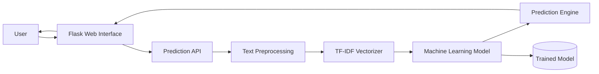

## System Architecture

```mermaid
flowchart LR

U[User]

U --> FE[Flask Web Interface]

FE --> API[Prediction API]

API --> PRE[Text Preprocessing]

PRE --> TFIDF[TF-IDF Vectorizer]

TFIDF --> MODEL[Machine Learning Model]

MODEL --> RESULT[Prediction Engine]

RESULT --> FE

FE --> U

MODEL --> DATA[(Trained Model)]
```
