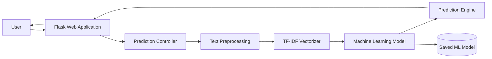
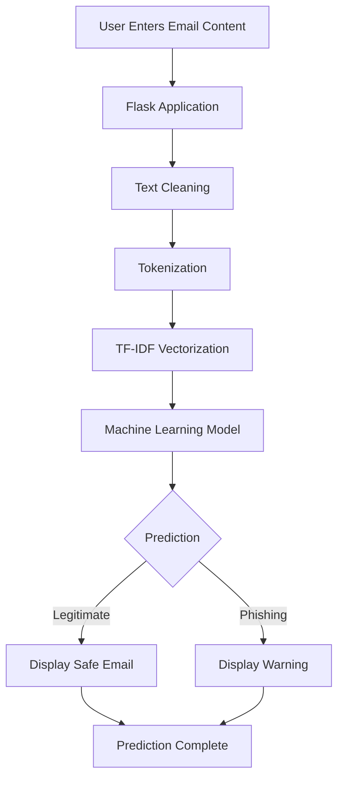
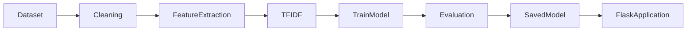

# PhishGuard AI

PhishGuard AI is a Machine Learning-powered phishing email detection system designed to identify malicious emails using Natural Language Processing (NLP) and supervised learning techniques. The application analyzes email content, extracts meaningful features, and predicts whether an email is **Phishing** or **Legitimate** through an interactive Flask web interface.

This project demonstrates the complete machine learning lifecycle—from data preprocessing and model training to deployment and real-time prediction—making it an excellent showcase of AI, cybersecurity, and software engineering skills.

---

# At a Glance

- **Problem:** Phishing emails are among the leading causes of cyberattacks, often tricking users into revealing sensitive information.
- **Solution:** Build an intelligent machine learning model capable of detecting phishing emails automatically.
- **Outcome:** Users can instantly analyze email content and receive accurate phishing predictions through a user-friendly web application.

---

# What This Project Demonstrates

- End-to-end Machine Learning workflow
- Natural Language Processing (NLP)
- Feature Engineering
- Text Classification
- Model Deployment using Flask
- Interactive Web Application
- Cybersecurity Awareness
- Real-time Prediction System

---

# Core Features

- Email phishing detection
- Machine Learning prediction engine
- NLP-based text preprocessing
- TF-IDF feature extraction
- Real-time prediction
- User-friendly Flask interface
- Safe vs Phishing visualization
- Confidence score prediction
- Fast inference
- Lightweight deployment

---

# System Architecture



---

# Prediction Workflow



---

# Machine Learning Pipeline



---

# Tech Stack

## Frontend

- HTML5
- CSS3
- JavaScript

## Backend

- Python
- Flask

## Machine Learning

- Scikit-learn
- Pandas
- NumPy
- Joblib

## NLP

- TF-IDF Vectorizer
- Text Preprocessing
- Tokenization

## Model

- Logistic Regression

## Tools

- VS Code
- Git
- GitHub

---

# Repository Structure

```

PhishGuard-AI/

│

├── dataset/

│ ├── phishing_dataset.csv

│

├── model/

│ ├── phishing_model.pkl

│ ├── vectorizer.pkl

│

├── static/

│ ├── css/

│ ├── images/

│

├── templates/

│ ├── index.html

│

├── app.py

├── train_model.py

├── requirements.txt

├── README.md

```

---

# Dataset

The project uses a labeled phishing email dataset consisting of phishing and legitimate emails.

Each email undergoes:

- Text Cleaning
- Lowercase Conversion
- Stopword Removal
- Tokenization
- Feature Extraction using TF-IDF

before training.

---

# Model Training

The machine learning model follows these stages:

1. Dataset Loading
2. Data Cleaning
3. Feature Engineering
4. TF-IDF Vectorization
5. Train-Test Split
6. Logistic Regression Training
7. Model Evaluation
8. Model Serialization using Joblib

---

# Installation

## Clone Repository

```bash
git clone https://github.com/AnnElsaJoy-projects/PhishGuard-AI.git

cd PhishGuard-AI
```

---

## Create Virtual Environment

Windows

```bash
python -m venv venv

venv\Scripts\activate
```

Linux / Mac

```bash
python3 -m venv venv

source venv/bin/activate
```

---

## Install Dependencies

```bash
pip install -r requirements.txt
```

---

## Run Application

```bash
python app.py
```

Flask Server

```
http://127.0.0.1:5000
```

---

# Usage

1. Open the Flask application.

2. Paste the email content.

3. Click **Analyze**.

4. The application preprocesses the email.

5. Features are extracted.

6. The Machine Learning model predicts:

- Legitimate Email

or

- Phishing Email

7. The prediction result is displayed instantly.

---

# Screenshots

## Home Page

(Add Screenshot Here)

---

## Prediction Result

(Add Screenshot Here)

---

# Suggested Review Path

If you're reviewing this project:

1. Read this README.

2. Inspect

```
train_model.py
```

to understand the ML pipeline.

3. Open

```
app.py
```

to view the prediction workflow.

4. Inspect

```
templates/index.html
```

for the user interface.

5. Review

```
model/
```

to understand saved artifacts.

---

# Current Constraints

- Uses a supervised learning model.
- Prediction quality depends on dataset quality.
- Works only for English emails.
- Requires retraining for new phishing patterns.
- Does not analyze email attachments.

---

# Future Enhancements

- Deep Learning models (LSTM/BERT)
- Explainable AI predictions
- Browser Extension
- Email Client Integration
- Real-time Gmail Outlook Plugin
- Multi-language Support
- URL Reputation Analysis
- Attachment Malware Detection

---

# Why PhishGuard AI Is Interesting

PhishGuard AI combines Artificial Intelligence, Natural Language Processing, and Cybersecurity into a practical real-world application. Rather than serving as a simple text classifier, it demonstrates how machine learning can be deployed into an interactive web application to improve email security and cybersecurity awareness.

The project showcases the complete ML lifecycle—from dataset preparation and model training to deployment and user interaction—making it an excellent demonstration of software engineering, AI, and cybersecurity skills.

---

# Author

**Ann Elsa Joy**

B.Tech Computer Science & Engineering

Mar Baselios Institute of Technology and Science (MBITS)
# License

This project is intended for educational and learning purposes.

© 2026 Ann Elsa Joy
